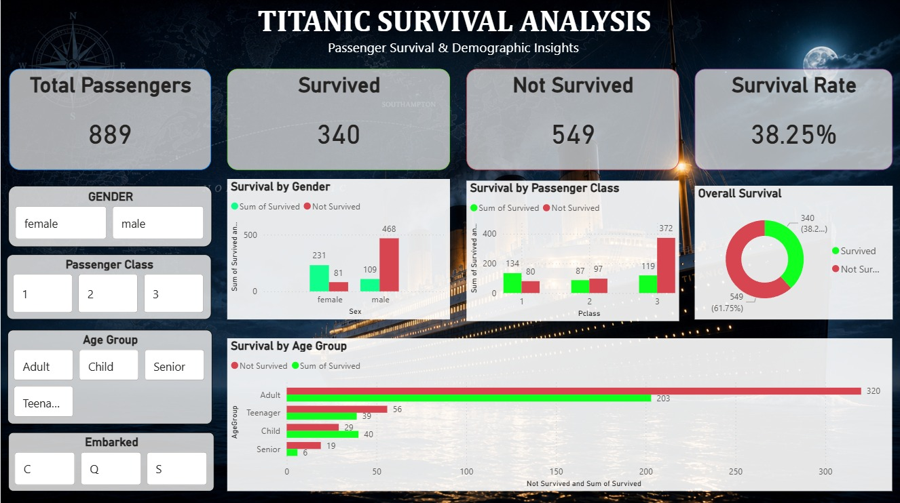

# Titanic-Survival-Analysis
End-to-end Titanic Survival Analysis using Python, Pandas, NumPy &amp; Power BI

# Titanic Survival Analysis

An end-to-end Titanic Survival Analysis project using Python, Pandas, NumPy and Power BI.

## Dashboard Preview

## Project Overview

This project analyzes passenger survival patterns from the Titanic dataset.

The data was explored and prepared using Python, Pandas and NumPy, followed by the development of an interactive Power BI dashboard to present key findings through KPIs, charts and interactive slicers.

## Key Performance Indicators

- Total Passengers: 889
- Survived: 340
- Not Survived: 549
- Survival Rate: 38.25%

## Key Insights

- Female passengers had a significantly higher survival rate than male passengers.
- First-class passengers had better survival outcomes compared with lower passenger classes.
- Male passengers accounted for a larger number of non-survivors.
- Survival outcomes varied across different age groups.
- Interactive filters allow users to explore survival patterns by gender, passenger class, age group and embarkation port.

## Dashboard Features

- Interactive KPI cards
- Survival analysis by gender
- Survival analysis by passenger class
- Survival analysis by age group
- Overall survival visualization
- Interactive slicers for:
  - Gender
  - Passenger Class
  - Age Group
  - Embarked Port

## Tools & Technologies

- Python
- Pandas
- NumPy
- Power BI
- DAX
- Data Cleaning
- Data Analysis
- Data Visualization

## Project Files

| File | Description |
|---|---|
| `Titanic_dashboard.jpeg` | Final Power BI dashboard preview |
| `titanic dashboard.pbix` | Power BI dashboard file |

## Objective

The objective of this project is to demonstrate data cleaning, exploratory data analysis, visualization and dashboard development skills using Python and Power BI.

## Author

**Himanshu Kashyap**
